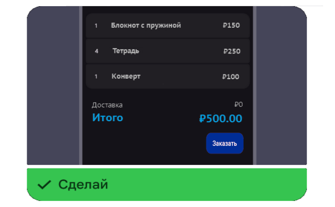
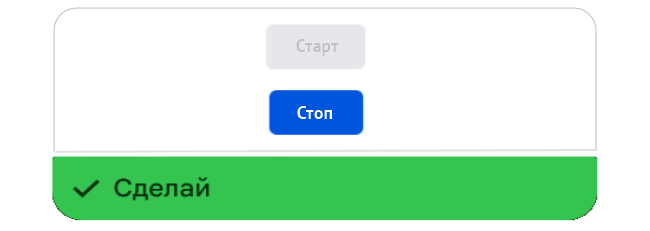
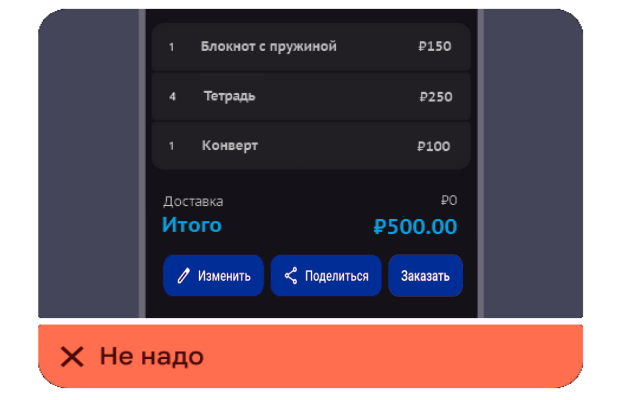
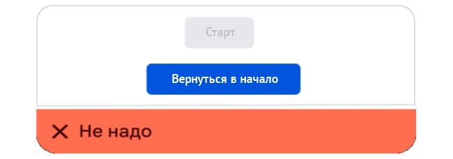

## Обзор. Компонент Button (Кнопка)

### Оглавление

- [Назначение](#назначение)
- [Внешний вид](#внешний-вид)
- [Конфигурации](#конфигурации)
- [Код кнопки. Типовое применение в React](#код-кнопки-типовое-применение-в-react)
- [Паттерны использования](#паттерны)
- [Анти-паттерны использования](#анти-паттерны)

## Назначение

Компонент Button (кнопка) — отдельная кнопка, которая даёт пользователю возможность выполнить действие или сделать выбор одним нажатием. Кнопки обычно размещают в модальных окнах, формах, карточках, панелях инструментов.<br>
Кнопки формируют первое впечатление о логике интерфейса пользователя, делая его интуитивно понятным.

## Внешний вид

Кнопки имеют форму прямоугольника с закругленными углами (за исключением [типа](./2-btn-types.md) `borderless`) и текстовое описание.<br>
Ширина кнопки определяется количеством текста и фиксированными отступами.<br>
Иконка или бейдж слева или справа от текста позволяют выделить кнопку среди других.<br>

Для подбора оптимальной кнопки и задания ей стиля предусмотрены:

- три [размера](/md/4-btn-sizes.md): `large`, `medium`, `small`;
- четыре [типа](/md/2-btn-types.md): `primary`, `secondary`, `tertiary`, `borderless`;
- шесть [состояний](/md/3-btn-states.md): `enabled`, `hover`, `active`, `disabled`, `pressed`, `loading`;
- иконка или бейдж слева или справа от текста (опционально).

## Конфигурации

<details open>
  <summary>Отдельная кнопка</summary><br>
  <a target="_blank" rel="noopener noreferrer" href="../img/1-single-btn.png"></a>
</details>

<details>
  <summary>Кнопки по состояниям и типам</summary><br>
  <a target="_blank" rel="noopener noreferrer" href="../img/1-conf-types-states-btn.png"></a>
</details>

<details>
  <summary>Кнопки с иконкой или бейджем с текстом</summary><br>
  <a target="_blank" rel="noopener noreferrer" href="../img/1-conf-icon-badge-btn.png"></a>
</details>

## Код кнопки. Типовое применение в React

<details>
  <summary><b><em>Для разработчиков</em></b></summary><br>
  
  Для создания кнопки используется тег <b><</b><b>button></b>. После рендеринга кнопка по умолчанию получит глобальный атрибут `tabindex="0"`.

В исключительном случае при создании кнопки с иконкой или бейджем без текста следует как минимум задать атрибут <b>aria-label</b> с кратким описанием для обработки скринридером — `Уточнить детали у дизайнера макета и разработчика`.
Оптимальнее вместо `aria-label` использовать компонент `VisuallyHidden` с необходимым текстом как наиболее универсальное решение для всех ассистивных технологий.

</details>

<details open>
  <summary>Типовой код применения в React</summary><br>

```JSX
// Кнопка типа "primary" с обработкой состояния loading (загрузка)
<Button kind="primary" vertSize="40" loading loadingMessage="Проверяем данные">Продолжить</Button>

// Кнопка типа "secondary"
<Button kind="secondary">Отменить</Button>

// Кнопка типа "tertiary"
<Button kind="tertiary">QR-код</Button>

// Кнопка типа "borderless"
<Button kind="borderless">Подробнее</Button>
```

</details>

[Вверх](#оглавление)
<br>

## Паттерны

### 1. Кнопка для дискретного действия

:star: Избыточное количество кнопок может нарушать визуальное восприятие.

<details open>
  <summary>Кнопка для дискретного действия</summary><br>
  <a target="_blank" rel="noopener noreferrer" href="../img/1-conf-1-pattern-btn.png"></a>
</details>

[Анти-паттерн](#1-избыточное-количество-кнопок-интерфейса)

### 2. Текст одинаковой длины для кнопок переключения

:star: В кнопках переключения следует использовать текст одинаковой длины для обоих состояний.

<details>
  <summary>Текст одинаковой длины для кнопок переключения</summary><br>
  <a target="_blank" rel="noopener noreferrer" href="../img/1-conf-2-pattern-btn.png"></a>
</details>

[Анти-паттерн](#2-текст-разной-длины-для-кнопок-переключения)

[Вверх](#оглавление)<br>

## Анти-паттерны

### 1. Избыточное количество кнопок интерфейса

:star: Низкоприоритетные действия необходимо размещать в меню или в виде кнопок с иконкой без текста.

<details open>
  <summary>Избыточное количество кнопок интерфейса</summary><br>
  <a target="_blank" rel="noopener noreferrer" href="../img/1-conf-1-antipattern-btn.png"></a>
</details>

[Паттерн](#1-кнопка-для-дискретного-действия)

### 2. Текст разной длины для кнопок переключения

:star: Длина текста в кнопке переключения не должна резко изменяться.

<details>
  <summary>Текст разной длины кнопок переключения</summary><br>
  <a target="_blank" rel="noopener noreferrer" href="../img/1-conf-2-antipattern-btn.png"></a>
</details>

[Паттерн](#2-текст-одинаковой-длины-для-кнопок-переключения)

[Вверх](#оглавление) | [К содержанию](../README_Buttons.md)
