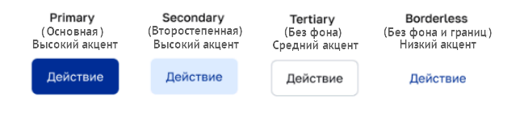

## Типы. Компонент Button (Кнопка)

## Описание

Доступны четыре типа кнопок: `primary`, `secondary`, `tertiary`, `borderless`. 
Тип кнопки задаётся в свойстве `kind`, например, `kind="primary"`. [Примеры кода кнопок](./1-btn-overview.md/#код-кнопки-типовое-применение-в-react). 

  
Типы кнопок
 
  

 

|  №  |      Тип       | Описание                                                                                                                                                                                                                  | Пример                                               |
| :-: | :------------: | ------------------------------------------------------------------------------------------------------------------------------------------------------------------------------------------------------------------------- | ---------------------------------------------------- |
|  1  |  **primary**   | Кнопка с **высоким акцентом** для выполнения основных действий                                                                                                                                                            | «Войти», «Отправить», «Открыть»                      |
|  2  | **secondary**  | Второстепенная кнопка с **высоким акцентом** для важных неосновных действий. Может применяться в сочетании с primary-кнопкой                                                                                              | «Регистрация», «Отмена», «Редактировать»             |
|  3  |  **tertiary**  | Кнопка со **средним акцентом** без фона для неосновных действий. Может применяться с primary- и secondary-кнопками как кнопка с более низким акцентом, так и с borderless-кнопками как кнопка с более высоким акцентом | «QR-код», «Электронная подпись», «Справка»           |
|  4  | **borderless** | Кнопка с **низким акцентом** без фона и границ для неосновных действий. Может применяться в формах, диалоговых окнах для сохранения акцента на их содержимом                                                              | «Восстановить пароль», «Подробнее», «Частые вопросы» |

[К содержанию](../README_Buttons.md)
