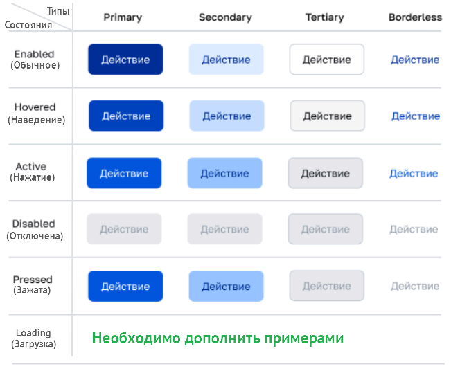

## Состояния. Компонент Button (Кнопка)

### Оглавление

- [Описание](#описание)
- [Состояния](#состояния)

## Описание

Доступны шесть состояний кнопок: `enabled`, `hover`, `active`, `disabled`, `pressed`, `loading`. 
Состояние задается соответствующим свойством. 
Пример кода для состояния «Загрузка» (loading): `<Button loading>Загрузка</Button>`.

  
Состояния кнопок
 
  

## Состояния

|  №  |    Свойство (Состояние)     | Описание                                                                                                                                                                                                                                                                                                                                       |
| :-: | :-------------------------: | ---------------------------------------------------------------------------------------------------------------------------------------------------------------------------------------------------------------------------------------------------------------------------------------------------------------------------------------------- |
|  1  |  **enabled** (обычное)   | Определяет стиль кнопки в обычном неактивном состоянии                                                                                                                                                                                                                                                                                         |
|  2  |  **hover** (наведение)   | Определяет изменение стиля кнопки при наведении на неё курсора мыши. Свойство не используется для мобильных устройств                                                                                                                                                                                                                          |
|  3  |   **active** (нажатие)   | Определяет изменение стиля кнопки во время нажатия (курсором мыши для десктопных или пальцем для мобильных устройств) и помогает пользователю понять, что действие было воспринято устройством                                                                                                                                                 |
|  4  | **disabled** (отключена) | Отключает возможность взаимодействия с кнопкой (нажатие, фокусировка и т. д.) и добавляет визуальную индикацию недоступности (повышение прозрачности, изменение цвета фона и текста в серый цвет, вида курсора и т. п.)                                                                                                                        |
|  5  |  **pressed**  (зажата)   | Определяет очень быстрое изменение состояния кнопки (в течение 100-150 мс) после касания для восприятия пользователем действия как мгновенное. Основное состояние при нажатии на кнопки мобильных устройств, т. к. нет промежуточных состояний hover и focus как на десктопных устройствах для мыши и клавиатуры                               |
|  6  |  **loading** (загрузка)  | Определяет изменение стиля всех типов кнопки после нажатия для демонстрации пользователю, что действие выполняется с задержкой и кнопка временно недоступна, предотвращая повторное нажатие. Характерная реализация: использование спиннера, визуальная блокировка кнопки (становится серой или прозрачной) и недоступность (некликабельность) |

[Вверх](#оглавление) | [К содержанию](../README_Buttons.md)
