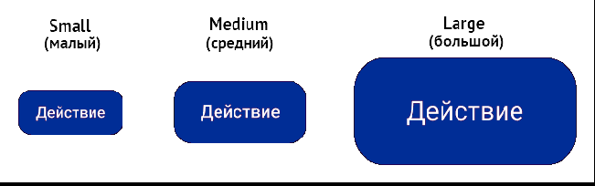

## Размеры. Компонент Button (Кнопка)

## Описание

Доступны три размера кнопок: `small`, `medium` и `large`.
Размеры задает свойство `size`, например, `size="small"`[^1]. 
Для кнопки предусмотрена возможность задания пользовательской высоты в свойстве `vertSize`, например, `vertSize="40"`. 
[Примеры кода кнопок](./1-btn-overview.md/#код-кнопки-типовое-применение-в-react). 
Ширина кнопки определяется количеством текста и фиксированными отступами. 

:star: Огранивайте ширину очень длинных кнопок в больших окнах или помещайте их рядом с другими элементами. 

  
Размеры кнопок
 
  

|  №  |   Размер   | Описание                                                                                                                   |
| :-: | :--------: | -------------------------------------------------------------------------------------------------------------------------- |
|  1  | **small**  | Маленькая кнопка для использования внутри текстовых блоков, рядом с ними или в ограниченном простанстве                    |
|  2  | **medium** | Средняя кнопка для большинства случаев использования: в пользовательских интерфейсах, в формах, диалогах и модальных окнах |
|  3  | **large**  | Большая кнопка для основного призыва к действию (CTA)[^2] на странице или в блоке                                          |

[К содержанию](../README_Buttons.md)

[^1]: Note: Необходима информация по заданию размера (пример кода, подтверждение названия свойства `size`, ограничения по заданию пользовательской высоты кнопки `vertSize`) от разработчика и макет с 3мя размерами основных типов кнопок от дизайнера.
[^2]: CTA (call to action) — прызыв к действию. Элемент, который побуждает пользователя совершить конкретное целевое действие, например, купить товар, подписаться на рассылку.
