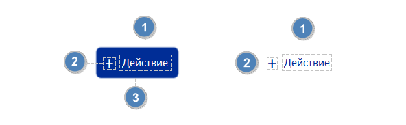

## Рекомендации по формулировкам и применению. Компонент Button (Кнопка)

### Оглавление

- [Анатомия](#анатомия)
- [Компоненты кнопки. Рекомендации по формулировкам и применению](#компоненты-кнопки-рекомендации-по-формулировкам-и-применению)

## Анатомия

  
Анатомия
 
  

 

## Компоненты кнопки. Рекомендации по формулировкам и применению

| Номер в анатомии |    Наименование    | Описание / Рекомендации                                                                                                                                                                                                                                                                                          |
| :--------------: | :----------------: | ---------------------------------------------------------------------------------------------------------------------------------------------------------------------------------------------------------------------------------------------------------------------------------------------------------------- |
|        1         |     **Текст**      | Текст в форме инфинитива описывает действие при нажатии на кнопку, например: «Отправить», «Войти» и др. **_Оптимальная длина текста 1-3 слова_**. Текстовые фразы («инфинитив» с «существительным») должны располагаться в одной строке, например: «Купить билет», «Открыть счёт»                                |
|        2         | **Иконка** (опция) | Ускоряет распознавание объекта, привлекает внимание к действию, команде или разделу. Иконку размещают на ведущей стороне кнопки перед текстом. Например, слева от текста при направлении письма слева направо (LTR-скрипт) и справа при направлении письма справа налево (RTL-скрипт)[^1]                        |
|        2         | **Бейдж** (опция)  | Значок для указания уведомления, количества элементов или другой информации. Бейдж размещают справа от текста для LTR-скрипта и слева для RTL-скрипта                                                                                                                                                            |
|        3         |   **Контейнер**    | Цветовое заполнение контейнера придаёт кнопке необходимый акцент или показывает текущее состояние. Контейнер содержит текст и иконку или бейдж (опция). Контейнер динамически расширяется для размещения текста в одну строку. Рекомендуется ограничивать ширину контейнера очень длинных кнопок в больших окнах |

[К содержанию](../README_Buttons.md)

[^1]: https://www.w3.org/International/questions/qa-scripts
